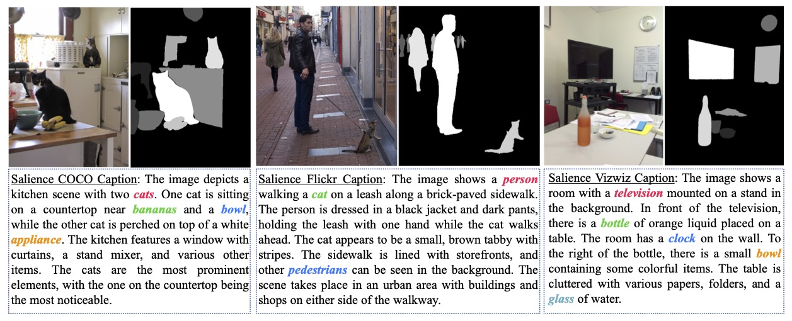
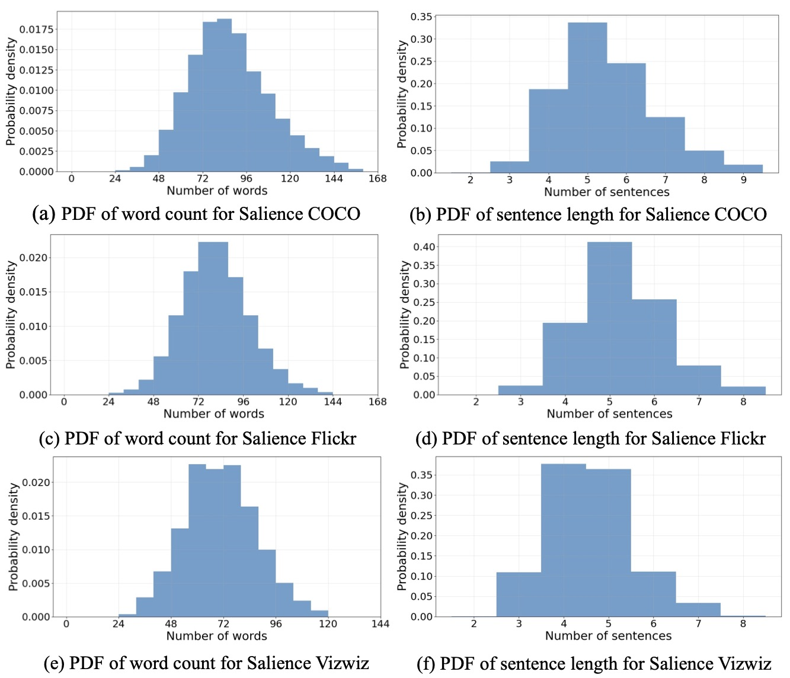
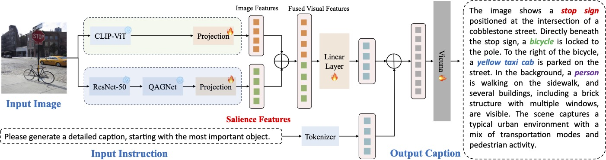

# Focus Where It Counts: A Salience-Driven Vision-Language Model for Low-Vision Assistance

This is the code for the paper "Focus Where It Counts: A Salience-Driven Vision-Language Model for Low-Vision Assistance"


## Salience Dataset:
To address the lack of salience information in existing datasets, we introduce three newly adapted datasets: Salience COCO, Salience Flickr, and Salience WizViz. All can be found in the following link:

Download dataset: <a href="https://drive.google.com/file/d/13YiuT3m2K8EP31HJkA9Gmx26AGyBTqpO/view?usp=sharing" target="_blank">Dataset</a>
### Example Data:

### Dataset Statistics:



## Salience-LLAVA Model Pipeline:
To establish a baseline for this dataset, we propose Salience-LLAVA, a novel model incorporating salience information into the VLM, LLaVA model.


## Installation: 
### Create conda environment 
All the required packages can be found in environment.yml. Some of them might need to be installed again manually just in case version issues arise.
- conda env create -f environment.yml

### Model Operations:
- Download the dataset from the link above, and place it in the `data` folder.
- Finetuning: Execute scripts in `/scripts/finetune/`. Make sure you change the `data_dir` to the path of the dataset you just downloaded.
- Evaluation: Run `FT_benchmark.py`

### Evaluation Metrics:
- Please collect the conversation json file
- Get the final evaluation results by running `json_eval.py`, make sure you change the `dir` to the path of the conversation json file you just collected as well as the GT provided by the dataset.

### Real World Experiment:
- coming soon


## Citing Salience-LLAVA:

If you find the Salience dataset or Salience-LLAVA beneficial for your work, please consider citing our research:
```
Coming soon
```
